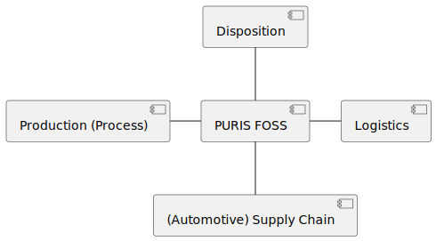

# System Scope and Context

The first draft of this application only targets to provide a possibility to enter and exchange stock information
related to partners. This application scope follows the following information.

## Business Context

PURIS FOSS may be operated in any supply network, but currently will likely be operated in the
automotive supply network.

**Disposition**
The disposition has a major information need to keep a material flow into and out of the production. The disposition
steers the allocation of material within the production. PURIS supports the disposition to identify shortages by
providing relevant information regarding the material flow.

**Production (Process)**
Production is the actually value-adding process of a manufacturer. It's demand is derived by outer factors such as
orders. A lack of material in supply chains leads to shortages. The production process has to be seen as a consumer of
data provided by PURIS (Catena-X data consumer) and as a provider of data to PURIS (Catena-X data provider). In that way
PURIS is able to fulfill the disposition's information need.

**Logistics**
For a production process it is necessary to fulfill its logistics requirements. That means that the material in demand
is given in the necessary quantity at the right time at the right place (see seven Rs above). PURIS targets to support
the information flow to overview this problem task.

**(Automotive) Supply Chain**
Supply chains synchronize demands with the supply. They are networks and not linear, as each customer commonly has more
than 1 supplier of services or physical goods. Supply chains are commonly supported by three flows: material flow,
finance flow and information flow. For PURIS the information flow is the relevant one.

- Customers send (demand) forecasts and purchase Orders to their suppliers or manufacturers.
- Suppliers and manufacturers send shipment information to their customers.

There are existing EDI formats describing this kind of information in a detailed way. Additionally, the VDA publishes
recommendations on how to use the DELFOR (UN standard EDI message) in the automotive supply chain. While the VDA
standards (delivery forecasts, delivery call-offs, orders, despatch advices, inventory reports, etc) only apply to the
first tiers of the automotive supply chain, later tiers won't be following the VDA standards - either because of their
size or because their operating their business in different domains. Those companies are likely to work with DELFOR
message standards, too OR even don't do EDI.

## Technical Context

The Technical Context has been derived from the architecture constraints:

**PURIS FOSS**

The PURIS FOSS is a system consuming short-term supply information supporting identification and mitigating shortages.

**SAMM**

SAMM is a technology used to define submodel information for the Asset Administration Shell (AAS). SAMM is used to
define the actual payload of the APIs used in PURIS FOSS.

**Tractus-X Connector**

The [Tractus-X Connector](https://github.com/eclipse-tractusx/tractusx-edc) (abbreviated and simplified as EDC) is a
Catena-X specific implementation of
the [Eclipse Dataspace Components Connector (EDC)](https://github.com/eclipse-edc/Connector) is an open-source framework
which can be used to participate within an International Data Space (IDS).

*Sovereign Data exchange*

To ensure data sovereignty, access and usage policies (prohibitions, permissions, obligations) may be attached as a
machine readable defintion by data owners before sharing their data. The data consumer has to accept the policies before
processing the data (human readable, machine readable). Connectors (and the underlying/corresponding systems) must
technically enforce usage policies while there is also legal governance. An access and usage contract can be negotiated
beforehand along with access and usage policies to ensure parties agree upon. It is necessary that data apps are
compliant to the usage policies, since the policies define data processing rules.
