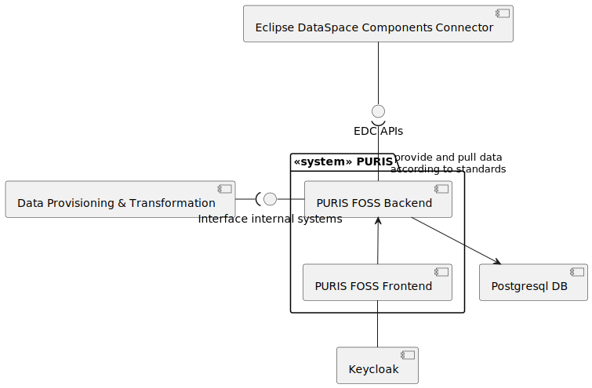
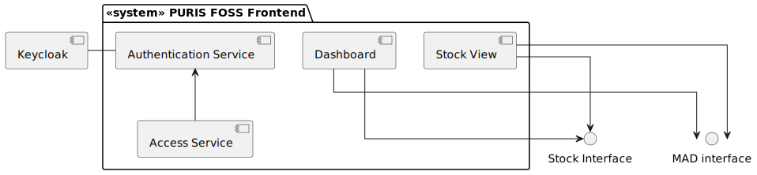

# Building Block View

The components or (sub-) systems do have the following capabilities. Please note that the authentication flows have
been omitted for readability.

| Component / system                 | Descriptions                                                                                                                                                                                                                              |
|------------------------------------|-------------------------------------------------------------------------------------------------------------------------------------------------------------------------------------------------------------------------------------------|
| Data Provisioning & Transformation | The Data Provisioning & Transformation Building Block handles the upload of data from internal systems into PURIS and provides capabilities for data transformation. **This component is not part of this repository**.                   |
| PURIS FOSS Backend                 | This system represents the PURIS FOSS application's logic. It handles the data exchange.                                                                                                                                                  |
| PURIS FOSS Frontend                | This system represents the PURIS FOSS user interface. It handles the data visualization.                                                                                                                                                  |                                                                                                                                                  
| EDC                                | The Eclipse Dataspace Components Connector (EDC) is the component allowing PURIS FOSS to participate in the IDS. It is used to provide and consume data assets following policy information. Any data transfer is routed through the EDC. |
| Keycloak                           | Keycloak is an identity provider that can manage multiple clients (applications). Catena-X allows the usage of a shared identity provider.                                                                                                |
| Postgresql DB                      | Database used by Backend to persist data                                                                                                                                                                                                  |

## Level 1 White Boxes

**PURIS FOSS Frontend**

The Frontend only handles visualization logic. The remaining logic is handled in the backend.

| Component / system     | Descriptions                                                                                                                                                 |
|------------------------|--------------------------------------------------------------------------------------------------------------------------------------------------------------|
| Stock View             | Allows to manually add or update stock information that is allocated to partners. Also latest stock information for partners may be requested (via backend). |
| Dashboard              | The dashboard allows to compare material-related demands, production outputs and stocks in a mocked way. Only Stock information is currently implements.     |
| Authentication Service | Encapsulates keycloak authentication and session management to be used by the main app.                                                                      |
| Access Service         | Steers based on the roles (see [Admin Guide](../../adminGuide/Admin_Guide.md)) which views may be visited by the user.                                       |

**PURIS FOSS Backend**

| Component / system | Descriptions                                                                                                                                           |
|--------------------|--------------------------------------------------------------------------------------------------------------------------------------------------------|
| EDC                | The EDC component provides the EDC implementations to create assets, negotiate contracts and intialize transfers.                                      |
| MAD                | Stores the partner and material related information. They may only be added via REST interfaces.                                                       |
| Stock              | Stores and handles stock related data. It provides interfaces to create and read stock data. Also it allows to exchange stock information via the EDC. |
