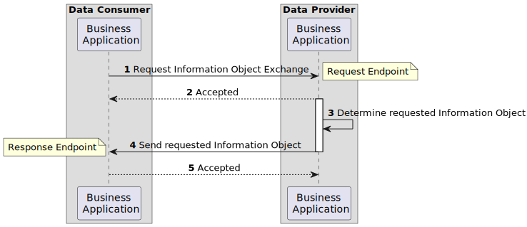
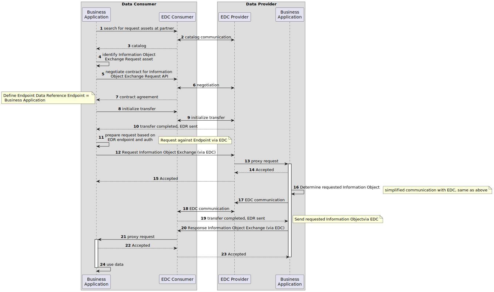

# Runtime View

The runtime view mainly focuses on two separate scenarios. One can either interact with the data or pull it.

## Scenario: Update partner-related data

The information exchange in PURIS follows a response and request pattern. Requests are directly answered based on
existing data as soon as they arrive. The diagram does not integrate the EDC to explain the overall flow.

The request and response flow both implement a message header and a content section in the exchanged data.

- the message header contains information about the message.
- the content contains either the request (material numbers) or the response (respective SAMM model as json payload).

The API implementations are provided and consumed via the EDC.

1. A data asset is created on Startup by the `AssetCreatedCommandLineRunner`.
1. To request new data
    1. the partners' catalog is queried to search for the request api.
    1. the contract is negotiated.
    1. the transfer is initialized using
       the [dynamic http receiver EDC extension](https://github.com/eclipse-edc/Connector/tree/main/extensions/control-plane/transfer/transfer-pull-http-dynamic-receiver).
    1. the "consumer pull" flow is used (
       see [sample](https://github.com/eclipse-edc/Samples/tree/main/transfer/transfer-06-consumer-pull-http))
        1. Provider receives EDR token by `EndpointDataReferenceReceiver`.
        1. Provider queries API for information of interest based on the standardized API description.
        1. Consumer receives request, determines data for response and starts with step 2 for the response interface.

The workflow with simplified EDC communication may be seen in the following sequence diagram.
EDC flow is the same to use the request and response api. Central Services, such as the Managed Identity Wallet are
ommitted.

## Scenario: Interact with data in web-ui

When reloading the UI, the latest data is pulled from the backend. Whenever an update on the information is performed,
then the frontend hands over the data to the backend to perform the action.

The web-ui allows the following interactions:

- create or update stocks for a partner.
- select a specific stock to see the related partner stocks.
- Trigger an update for all partner's data for a specific material (see previous Scenario).
