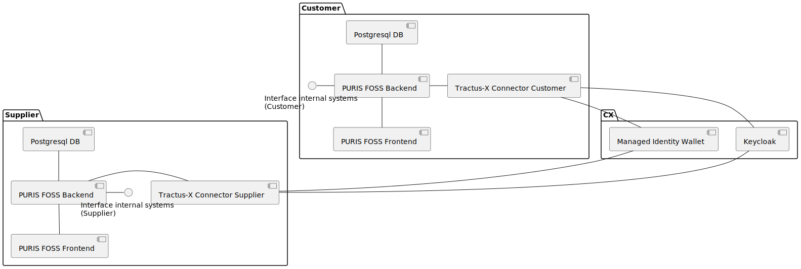

# Deployment View

## Local Deployment

Overall the Deployment locally looks similar to the following graphic.

**Docker**

_to be merged_

**Helm / Kubernetes**

One can configure the two local helm environments using the product helm chart and the [mxd tutorial](https://github.com/eclipse-tractusx/tutorial-resources/tree/main/mxd).

## ArgoCD Deployment (e.g. INT)

_to be done_
