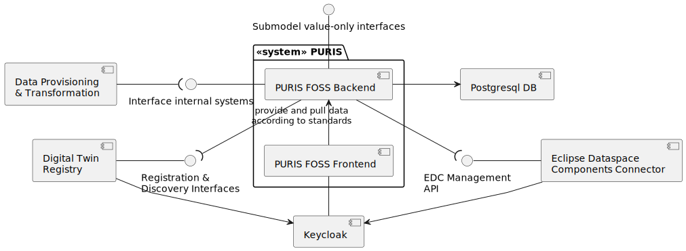
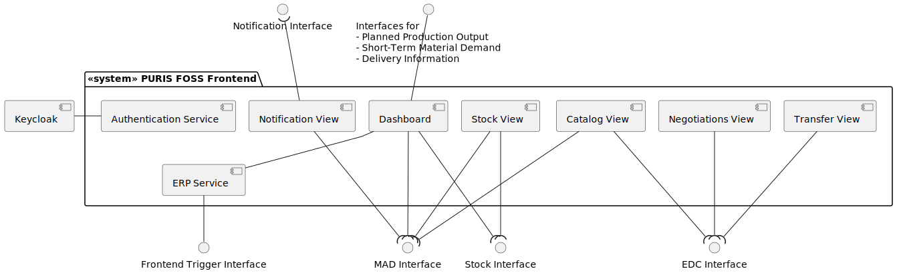
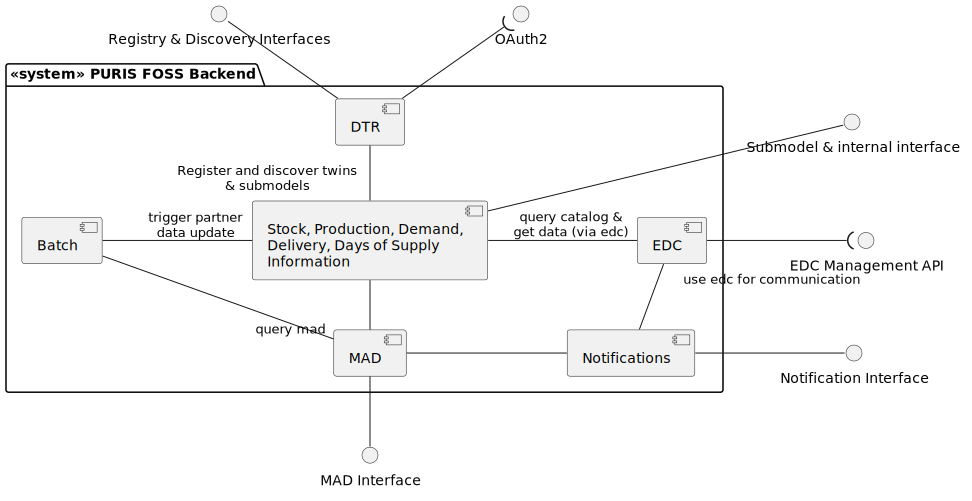

# Building Block View

The components or (sub-) systems do have the following capabilities. Please note that the authentication flows have
been omitted for readability.

| Component / system                 | Descriptions                                                                                                                                                                                                                                                                                        |
|------------------------------------|-----------------------------------------------------------------------------------------------------------------------------------------------------------------------------------------------------------------------------------------------------------------------------------------------------|
| Data Provisioning & Transformation | The Data Provisioning & Transformation Building Block handles the upload of data from internal systems into PURIS and provides capabilities for data transformation. **This component is not part of this repository**.                                                                             |
| PURIS FOSS Backend                 | This system represents the PURIS FOSS application's logic. It handles the data exchange.                                                                                                                                                                                                            |
| PURIS FOSS Frontend                | This system represents the PURIS FOSS user interface. It handles the data visualization.                                                                                                                                                                                                            |                                                                                                                                                  
| EDC                                | The Eclipse Dataspace Components Connector (EDC) is the component allowing PURIS FOSS to participate in the IDS. It is used to provide and consume data assets following policy information. Any data transfer is routed through the EDC.                                                           |
| Keycloak                           | Keycloak is an identity provider that can manage multiple clients (applications). Catena-X allows the usage of a shared identity provider. Also the DTR can use a keycloak that allows manage access to the PURIS backend and Read access through the EDC                                           |
| Postgresql DB                      | Database used by Backend to persist data                                                                                                                                                                                                                                                            |
| Digital Twin Registry              | Software Service that implements the AAS Discovery and Registry Interfaces. PURIS FOSS registers materials as ShellDescriptors with the respective information as Submodels. These SubmodelDescriptors do have a DSP endpoint linking to the EDC to contract the usage and how to get the submodel. |

## Level 1 White Boxes

**PURIS FOSS Frontend**

For readability reasons, the building block view shows summarized interfaces.

The Frontend only handles visualization logic. The remaining logic is handled in the backend.

| Component / system     | Descriptions                                                                                                                                                 |
|------------------------|--------------------------------------------------------------------------------------------------------------------------------------------------------------|
| Stock View             | Allows to manually add or update stock information that is allocated to partners. Also latest stock information for partners may be requested (via backend). |
| Dashboard              | The dashboard allows to compare material-related demands, production outputs and stocks in a mocked way. Only Stock information is currently implements.     |
| Authentication Service | Encapsulates keycloak authentication and session management to be used by the main app.                                                                      |
| Access Service         | Use to give control the access to views.                                                                                                                     |

**PURIS FOSS Backend**

For readability reasons, the building block view shows only the stock related information. The strucutre for the other
information objects is the same:

- planed production output
- short-term material demand (demand)
- delivery information

The building block view describes only the responsibilities of the components/ packages.

| Component / system | Descriptions                                                                                                                                                     |
|--------------------|------------------------------------------------------------------------------------------------------------------------------------------------------------------|
| EDC                | The EDC component provides the EDC implementations to create assets, negotiate contracts and intialize transfers. query partners' DTR and consume Submodel data. |
| MAD                | Stores the partner and material related information. They may only be added via REST interfaces.                                                                 |
| Stock              | Stores and handles stock related data. It provides interfaces to create and read stock data. Also it allows to exchange stock information via the EDC.           |
| DTR                | The DTR component provides the DTR implementations to manage ShellDescriptors. May first need to get a OAuth 2 token for authentication.                         |

## NOTICE

This work is licensed under the [Apache-2.0](https://www.apache.org/licenses/LICENSE-2.0).

- SPDX-License-Identifier: Apache-2.0
- SPDX-FileCopyrightText: 2024 Contributors to the Eclipse Foundation
- Source URL: https://github.com/eclipse-tractusx/puris
