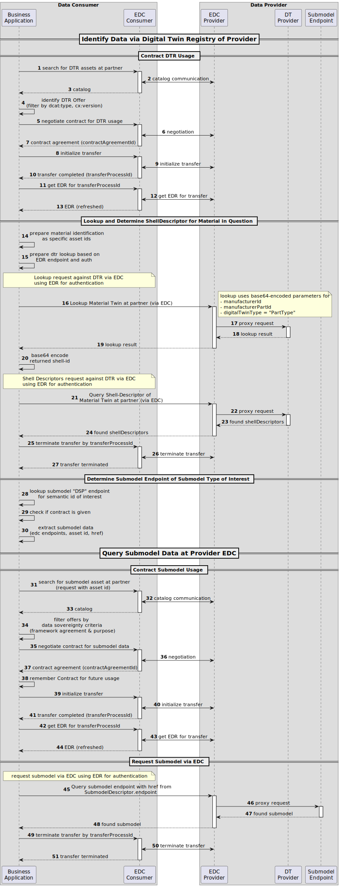
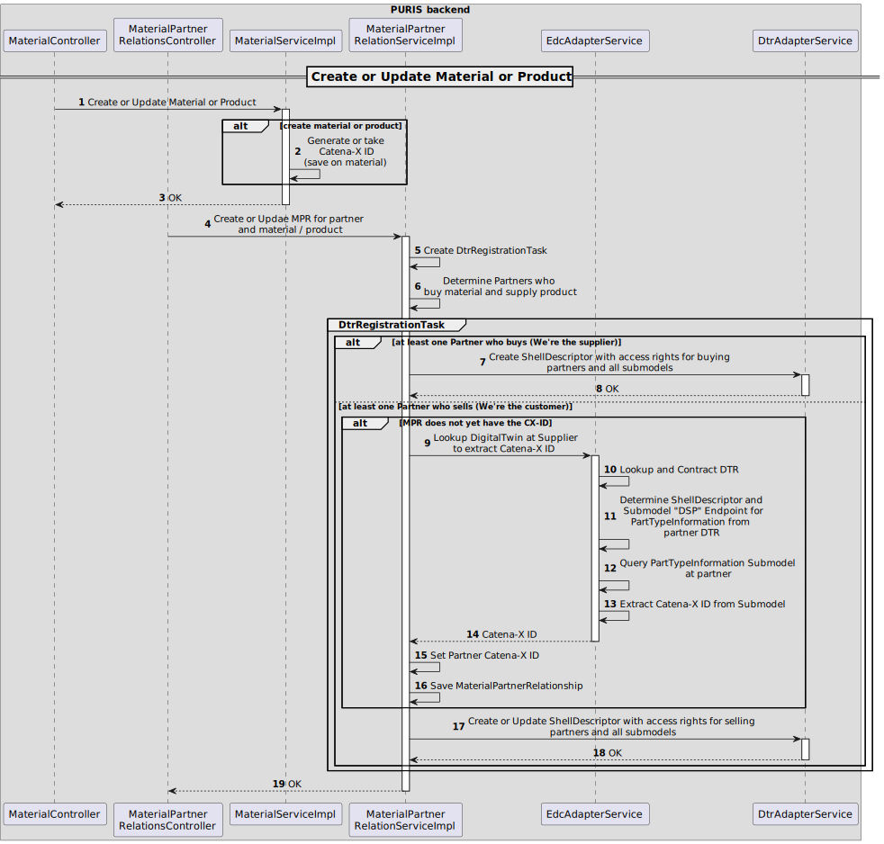

# Runtime View

The runtime view mainly focuses on the following scenarios:

- Update partner-related data
- Create Digital Twins for Material or Product
- Interact with Data in the Web-UI

## Scenario: Update partner-related data

The information exchange in PURIS follows a shared asset approach of the Digital Twin KIT and the Industry Core KIT.
This means:

- A Digital Twin Registry is needed to lookup the data and know how to pull data
- Information is exchanges as Submodel in Form of Submodel JSON-only serializations
- All traffic is routed through EDCs

Following the PURIS standards, currently one asset per Submodel Type is wanted.

Roughly said the following steps need to be achieved to lookup a Submodel Y for a Material X of a Partner Z:

1. Contract `Digital Twin Registry (DTR)` of Partner Z at `EDC`
    1. Query Catalog of `EDC` of Partner Z (filter by `dcat:type` and `cx-common:version`)
    2. Contract usage of `DTR` of Partner Z (no consumer-side check of policy)
    3. Initialize Transfer to query `DTR`
    4. Get Endpoint Data Reference (EDR, auth token for Data Plane request for `DTR` of Partner Z)
2. Determine Twin of Partner Z for Material X via proxy call through `EDC`:
    1. Lookup Material Twin by specificAssetIds (`manufacturerId`, `manufacturerPartId`, `digialTwinType`) which returns
       ShellDescriptor ID
    2. Get ShellDescriptor by ID (base 64 encoded ID)
    3. Terminate Transfer for `DTR`
3. From result, extract needed information to get `Submodel Y`
    1. Determine the `SubmodelDescriptor` by Semantic ID of the Submodel Type in question.
    2. Determine the endpoint of that `SubmodelDescriptor` of type `DSP`
    3. Extract href, assetId (`Submodel Asset`), dspUrl
7. Contract `Submodel Asset` same as `DTR` but with following differences
    1. For communication, use the dspUrl extracted from `SubmodelDescriptor`
    2. Catalog query filters by `assetId` extracted from `SubmodelDescriptor`
    3. Prior to usage the catalog offers are filtered for an offer your application supports:
       PURIS FOSS only allows policies with Exactly one `FrameworkAgreement` and one `UsagePurpose`. It only accepts the
       same Policy it offers (see [Admin Guide](../admin/Admin_Guide.md))
4. Query `Submodel Y` trough `EDC`
5. Terminate Transfer for `Submodel Y`

The workflow with simplified EDC and DTR communication may be seen in the following sequence diagram.
Central Services, such as the `Credential Service` and `Secure Token Service` are ommitted as these are handled by the
`EDC`.

## Scenario: Create Digital Twins for Material or Product

A Digital Twin is created for partners as soon as at least one buyer or supplier is known.
Following the Digital Twin Shared Asset Approach, each partner needs his view on the Digital Twin.
Following the Industry Core, the Supplier Twin dictates the Catena-X ID (also set as globalAssetId). Thus, the Customer
needs to lookup and use this Catena-X ID as the `globalAssetId`

- during data exchange scenarios and
- to register his Digital Twin

The following diagram illustrates the registration (create and update) process for digital twins. It is always triggered
as soon as a MaterialPartnerRelation is changed. The Digital Twin is always recreated fully.

## Scenario: Interact with Data in the Web-UI

When reloading the UI, the latest data is pulled from the backend. Whenever a partner-related update on the information
is performed, then the frontend hands over the request to the backend to perform the action.

Details on the Web-Ui can be found in the [User Guide](../user/User_Guide.md).

## NOTICE

This work is licensed under the [Apache-2.0](https://www.apache.org/licenses/LICENSE-2.0).

- SPDX-License-Identifier: Apache-2.0
- SPDX-FileCopyrightText: 2024 Contributors to the Eclipse Foundation
- Source URL: https://github.com/eclipse-tractusx/puris
