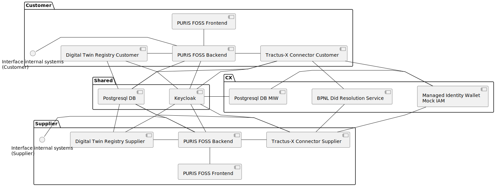
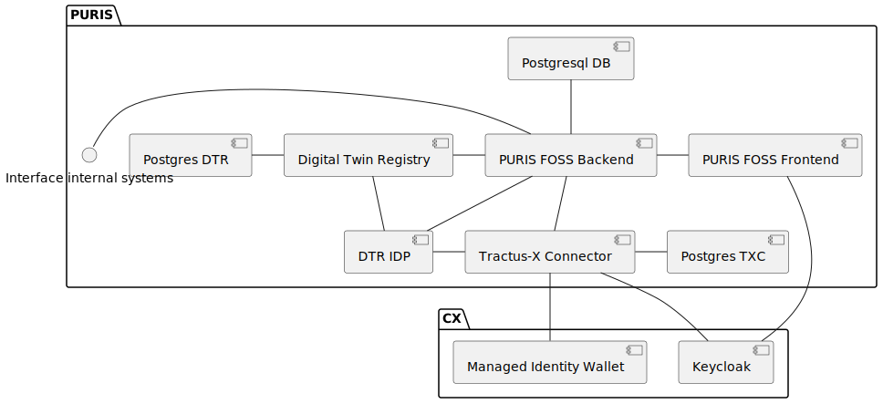

# Deployment View

## Local Deployment

Overall the Deployment locally using the [INSTALL.md in local](../../local/INSTALL.md) looks similar to the following
graphic.

The local deployment includes a mock of the dim service acting as a Central Wallet following IATP flow. Please refer to
[Mock IAM documentation](../../local/iam-mock/README.md) for further information.

It uses one `Keycloak` (IDP) for everything except the PURIS Frontend (needs an external keycloak, not included in local
deployment). It has three realms (Customer, Supplier, MIW).

_Note: MIW is currently commented out and the mock iam is used instead. With R24.08 hopefully the MIW can be used again.
_

It uses one DBMS (`Postgres DB MIW`) for the MIW and one for the rest (`Postgresql DB` for both `DTR`, `EDC`,
`PURIS Backend`) with each a separate Database.

**Helm / Kubernetes**

One can configure the two local helm environments using the product helm chart and
the [mxd tutorial](https://github.com/eclipse-tractusx/tutorial-resources/tree/main/mxd).

_Note: For Release R24.05 currently not possible._

## ArgoCD Deployment (e.g. INT)

The very basic deployment for one PURIS FOSS looks as follows:

The keycloak may be configured to be used. Also, a decentral instance may be connected to the frontend. Refer to the
[helm docs](../../charts/puris/README.md) for further information.

The following components are not part of the [puris helm chart](../../charts/puris/README.md) but need to be deployed
per partner:

- `DTR` including `Postgres` and `Keycloak / IDP`
- `Connector` including `Postgres`

The chart allows also to either install the database as a dependency or bring your own.

## NOTICE

This work is licensed under the [Apache-2.0](https://www.apache.org/licenses/LICENSE-2.0).

- SPDX-License-Identifier: Apache-2.0
- SPDX-FileCopyrightText: 2024 Contributors to the Eclipse Foundation
- Source URL: https://github.com/eclipse-tractusx/puris
