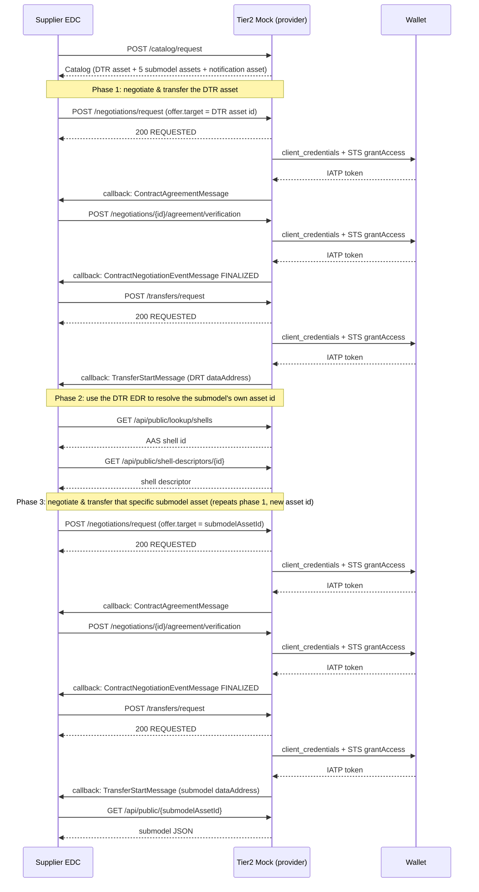
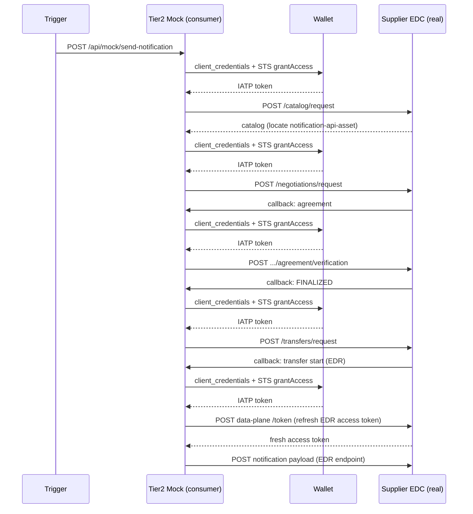

# The Tier-2 Mock Participant

A single FastAPI container that stands in for an entire upstream partner (EDC connector, Digital Twin Registry, and PURIS backend) so the Supplier PURIS instance can be tested against an additional partner without running another full application stack.

---

## Contents

1. [Overview](#1-overview)
2. [Why a mock, not a real partner](#2-why-a-mock-not-a-real-partner)
3. [Architecture](#3-architecture)
4. [Authentication & trust](#4-authentication--trust)
5. [Catalog](#5-catalog)
6. [DTR](#6-dtr)
7. [Negotiation & transfer: mock as provider](#7-negotiation--transfer-mock-as-provider)
8. [Outbound notification: mock as consumer](#8-outbound-notification-mock-as-consumer)
9. [Running & testing](#9-running--testing)

---

## 1. Overview

The local PURIS FOSS application deployment demonstrates a two-tier supply chain with 2 participants: a Customer and a Supplier, each with their own EDC connector, Digital Twin Registry, and PURIS backend.

 Simulating a **third** participant, Supplier's own supplier, "Tier-2", the same way would mean deploying and wiring up another full connector + DTR + backend stack. This work replaces that with one Python service.

The mock participant speaks just enough of the Dataspace Protocol (DSP 1.0) and the Tractus-X EDC's HttpData-PULL data plane convention to be indistinguishable, from the Supplier EDC's point of view, from a real partner connector. It serves a static Digital Twin Registry shell and five submodel payloads (ItemStock, PlannedProductionOutput, DeliveryInformation, DaysOfSupply, PartTypeInformation). It can also act as the initiator of an outbound DemandAndCapacityNotification back to the Supplier, driving a full negotiate → transfer → POST cycle against the real Supplier EDC.

**Submodels not included.** For now the mock does not include the following:

- **ShortTermMaterialDemand** (`urn:samm:io.catenax.short_term_material_demand:1.0.0`), a customer-side submodel; the mock only supports the supplier role.
- **SingleLevelBomAsPlanned** (`urn:samm:io.catenax.single_level_bom_as_planned:3.0.0`), self request only; not provided to partners
- **ItemStockAnonymized / DeliveryInformationAnonymized / PlannedProductionOutputAnonymized**, self request only; not provided to partners

## 2. Why a mock, not a real partner

The alternative to a mock is a third copy of everything: EDC control plane, EDC data plane, DTR and a PURIS backend, just to have something on the other end of a contract negotiation.

That's a lot of moving parts for what local demos and integration tests actually need to prove: that the Supplier PURIS backend can discover a partner's catalog, negotiate a contract, pull data through the resulting EDR, and both send and receive a capacity notification. The mock participant implements exactly the surface area required for that (nothing more) while still going through the real Supplier EDC and the real wallet for every credentialed exchange, so the parts of the system actually under test stay real.

## 3. Architecture

The mock participant is a **DSP provider** when the Supplier pulls data from it, and a **DSP consumer** when it pushes a notification to the Supplier. Both roles talk to the same real Supplier EDC and the same real wallet.

The mock never talks to the Supplier's DTR or backend directly. Every exchange goes through the same DSP/HTTP surface a real EDC connector would use.

**Module layout**

- `main.py`: FastAPI routes only; delegates all logic to the modules below.
- `data.py`: the static DTR shell and the five PURIS submodel payloads, keyed off a BPNL-derived deterministic UUID so IDs stay stable across restarts.
- `dsp/common.py`: shared constants, the ODRL permission block, and the wallet/IATP token exchange used by every other module.
- `dsp/catalog.py`: builds the catalog offered to consumers.
- `dsp/negotiations.py` & `dsp/transfers.py`: the mock's *provider*-side state machines, in-memory, for when a real EDC negotiates against the mock.
- `dsp/outbound.py`: the mock's *consumer*-side flow, for when the mock itself initiates a negotiation against the real Supplier EDC to deliver a notification.

## 4. Authentication & trust
The mock is authenticated very differently depending on which direction traffic is flowing, and that asymmetry is deliberate.

Catena-X connectors authenticate each other via **IATP** (Identity And Trust Protocol): the consumer authenticates to its own wallet's Secure Token Service and requests a token scoped to a specific counterparty and set of verifiable-credential types, getting back a short-lived, self-issued bearer JWT. `dsp/common.py:get_iatp_token()` implements exactly that two-step exchange: an OAuth2 `client_credentials` call to `{WALLET_URL}/oauth/token`, using the caller's own BPNL as `client_id`, followed by a `POST {WALLET_URL}/api/sts` with the requested credential types and consumer/provider DIDs, returning the `jwt` that gets attached as `Authorization: Bearer <token>`.

**As provider: unauthenticated inbound, authenticated outbound callbacks** (Supplier EDC ↔ mock)

- Catalog, negotiation, transfer, and data-plane (`/api/public/*`) endpoints accept **any** caller; no inbound token is checked.
- The EDR handed out in `dspace:dataAddress` carries a fixed placeholder bearer (`"tier2-mock-token"`) that is never validated on receipt either.
- Safe here only because the mock is reachable exclusively inside the local docker-compose network, by the demo's own Supplier EDC. Not a pattern to copy into anything internet-facing.
- The async callback *pushes* the mock sends back to the Supplier EDC (`ContractAgreementMessage`, the FINALIZED event, `TransferStartMessage`) are the exception: they're outbound calls into the real, policy-enforcing EDC, so `dsp/negotiations.py` and `dsp/transfers.py` route them through `push_dsp_message()`, which attaches a fresh IATP bearer token. Unauthenticated only applies to inbound traffic to the mock; any outbound traffic from the mock is authenticated regardless of which DSP role it's playing.

**As consumer: fully authenticated outbound** (mock → Supplier EDC, real)

- Every outbound catalog, negotiation, transfer, and verification call carries a fresh IATP token. This is required, because the real Supplier EDC does enforce it. `dsp/outbound.py` gets these directly via `get_iatp_token()` / `auth_headers()` rather than through `push_dsp_message()` (that helper is provider-side only, see above).
- The Supplier EDC's own callbacks landing back on the mock (agreement, FINALIZED event, transfer-start) hit the mock's consumer-callback routes.  As inbound traffic, these requests are once again accepted without authentication check.
- Posting the notification payload itself uses the EDR from the transfer: if the EDR carries a refresh token, the mock refreshes it first against the Tractus-X data-plane `/token` endpoint since a cached EDR may be stale; otherwise it falls back to using the EDR's bearer token as-is.

> **Why the asymmetry is fine.** The mock's job is to be a convincing *peer* for the real Supplier EDC, not to reimplement access control. The line isn't drawn by DSP role (provider vs. consumer); it's drawn by direction: any call the mock makes *out* to the real Supplier EDC carries a real IATP token, because that EDC enforces it and the call would otherwise be rejected. Any call landing *on* the mock's own endpoints (inbound negotiation/transfer requests as provider, or inbound callbacks as consumer) goes unchecked, because there's no policy enforcement to satisfy on the mock's side, and adding fake enforcement would just be more code standing in for something the mock doesn't need to prove.

## 5. Catalog

`GET /api/v1/dsp/.well-known/dspace-version` answers the protocol-discovery probe the Tractus-X EDC makes before it will negotiate at all: it advertises protocol version `2025-1` (the concrete version string this Tractus-X EDC release speaks for DSP 1.0) at path `/2025-1`, so every other DSP route below lives under `/api/v1/dsp/2025-1/...`. `POST /api/v1/dsp/2025-1/catalog/request` then returns a DCAT catalog listing the DTR asset, the five submodel assets, and a `notification-api-asset`, every offer carrying the same ODRL policy: the PURIS framework agreement (`DataExchangeGovernance:1.0`) plus usage purpose `cx.puris.base:1`.

| Method | Path | |
|---|---|---|
| `GET` | `/api/v1/dsp/.well-known/dspace-version` | protocol discovery |
| `POST` | `/api/v1/dsp/2025-1/catalog/request` | DCAT catalog |

## 6. DTR

DTR lookups follow the standard shell/submodel-descriptor shape, pointing back at the mock's own `/api/public/*` data plane for each submodel's `SUBMODEL-3.0` endpoint. The submodel payloads themselves are fixed, minimally valid sample data, not simulated over time.

| Method | Path | |
|---|---|---|
| `GET` | `/api/public/lookup/shells` | DTR shell lookup by manufacturerPartId |
| `GET` | `/api/public/shell-descriptors/{id}` | AAS shell descriptor |
| `GET` | `/api/public/{assetId}` | submodel payload (HttpData-PULL) |

## 7. Negotiation & transfer: mock as provider

`dsp/negotiations.py` and `dsp/transfers.py` implement real, callback-driven state machines, matching how an EDC actually negotiates: asynchronously, via pushed callback messages rather than long-held HTTP responses.

Each offer in the catalog covers exactly one asset, and a negotiation always targets one specific offer (`_extract_asset_id()` in `dsp/negotiations.py` reads the asset straight off `offer.target`). So a single negotiate/transfer cycle only ever hands back an EDR for that one asset. That's enough to reach the DTR, since the DTR is itself just one asset, but not enough to reach a submodel, because a submodel's asset id isn't known in advance; it only shows up once you've read the DTR's shell descriptor. Getting a submodel therefore takes **two separate negotiate/transfer cycles**: first one for the DTR asset, then a second one for that specific submodel asset, using the submodel asset id named in the shell descriptor's `subprotocolBody`.

Every callback above routes through `push_dsp_message()` (in `dsp/negotiations.py` and `dsp/transfers.py`), which fetches a fresh IATP token before sending (see [§4](#4-authentication--trust)). Inbound requests from the Supplier EDC get no such check: the mock accepts those unauthenticated.

## 8. Outbound notification: mock as consumer

`dsp/outbound.py` lets the mock *initiate* a negotiation against the real Supplier EDC, to deliver a `DemandAndCapacityNotification` the other direction: Tier-2 flagging a capacity disruption up to the Supplier.

Each call in this flow, apart from the final notification POST, requests its own IATP token with no shared cache (same as the provider-side flow in [§7](#7-negotiation--transfer-mock-as-provider)). That final POST goes to the Supplier's data plane rather than its DSP/IATP-aware control plane, and the data plane only recognizes the transfer-scoped access token it issued when the transfer started, so the mock authenticates with the EDR's own token instead of a fresh IATP one.

## 9. Running & testing

`local/deploy.sh` also builds the mock's image (`docker compose build puris-mock-participant`) before bringing the stack up; `docker-compose.yaml` adds a `puris-mock-participant` service on port `8083`, joined to the same `miw-net` as the wallet and EDCs.

The Bruno collection `Test_04-Tier2-Mock` walks the whole thing in order:

| Folder | Exercises |
|---|---|
| `01-Setup` | Mock health check, catalog-shape assertions (7 assets), registers Tier-2 as a real Partner + material-partner-relation in the Supplier PURIS backend. |
| `02-Verify` | Triggers a real Supplier → Tier-2 partner-data-update, asserts the reported ItemStock came back through the full DSP path. |
| `03-Tier2-Sends-Notification` | Triggers the mock's outbound flow, asserts the Supplier received and stored the reported notification. |
| `04-Manual-EDC-Walkthrough` | Raw, step-by-step catalog / negotiate / transfer / EDR / fetch calls, for debugging without backend orchestration in the way. |
