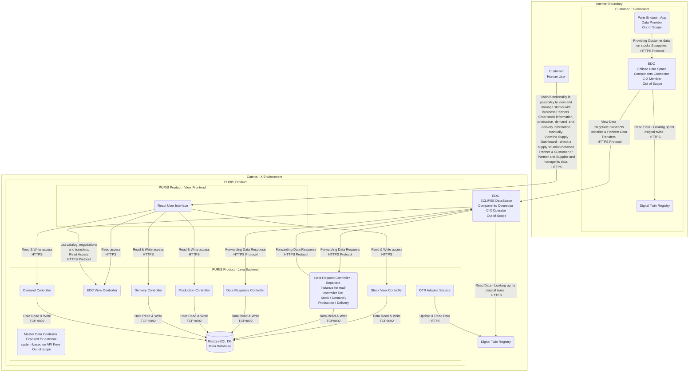

# Security Assessment PURIS (incl. Frontend, Backend Services, IAM and other infrastructure)

| Contact                  | Details                                                                           |
| -------------------------  | ---------------------------------------------------------------------------------------------- |
| Contact for product        | [@tom-rm-meyer-ISST](https://github.com/tom-rm-meyer-ISST) |
| Security responsible       | [@SSIRKC](https://github.com/SSIRKC)   [@szymonkowalczykzf](https://github.com/szymonkowalczykzf) |
| Version number of product  | 24.05                                                                                         |
| Dates of assessment        | 2023-12-11: Assessment                                                                      |
| Dates of last re-assessment| 2024-05-13: Re-Assessment                                                                      |
| Status of assessment       | RE-ASSESSMENT DONE & APPROVED                                                                            |

## Product Description
Application Security review provides information about application design, architecture and current security state.
The Predictive Unit Real-Time Information System (PURIS) provides the capabilities to exchange the production related information within a given relationship between two business partners such as the already available stock of the supplier, the current stock of the customer and the customer's demand. The aim is to help to mitigate potential and actual shortage scenarios.

PURIS is the second of two components of the Demand and Capacity Management as approached by the Resiliency Kit:
* A planning component forecasting its demands and capacities for the next months up to multiple years.
* An operationalization component verifying the demands and capacities of its actual production plan from today up to multiple weeks.

Within the Business Domain Resiliency, the Demand and Capacity Management (DCM) represents the planning and the PURIS represents the operationalization component. Considering a shorter time period in PURIS based on the production plan, results in more reliable information.
Generally, the Demand and Capacity Management needs a close cooperation between a company and its partners along the supply chain.
Within the value chain, each partner needs to plan his own production and relies on his customers' demand forecasts. The bullwhip effect describes the rising amplified deviation between orders to suppliers and sales to buyers along the value chain. The fluctuation rises from tier to tier. Using the latest production related information, you can mitigate the bullwhip effect for you and your partners within the value chain.

As a customer, you can verify the production related information of your partner so that you can identify potential shortages earlier with less effort and mitigate or resolve them spending less resources.
As a supplier, you can increase your production efficiency, e.g. by optimizing your batch size based on your customers' latest demands.

Currently the PURIS Application have 1 main functionality:
* Customers can View and Manage Stocks in the app.
* Additionally, adminsitrative views for the edc are in place. Also functionality related to the fully functional Customer dashboard is currently under creation.
* The rest of the functionalities, especially the resiliency ones are currently  not yet implemented and only planned for the further development & implementation for upcoming future.

## Scope of the review
|ID | Component Description |
| ------------------------- | ------------------------- |
|1 | Vue User Interface (Frontend) |
|2 | Stock View Controller |
|3 |	H2 Database |
|4 |	Data Response Controller |
|5 |	Data Request Controller |

## Dataflow Diagram

## Vulnerabilities & Threats
| V001 | Lack of authentication & authorization mechanisms |
| ------------------------- | ------------------------- |
| Element | PURIS IAM Policy |
| Before Mitigation | Impact: High, Likelihood: High, Risk: High |
| After Mitigation | Impact: Low, Likelihood: Low, Risk: Low |
| Mitigation | Authentication & authorization concept implemented. The front-end provides a Key Cloak integration. (C-X Central Identity Provider is in use.) Puris product may be accessed only by authenticated and authorized personnel, it restricts accessible views based on the client roles: PURIS_USER - common views related to short term information needs PURIS_ADMIN - EDC related views (may be used for debugging)|

| V002 | Lack of User session management controls, including token handling. That pose a security risk, that can lead to unauthorized access and session hijacking. |
| ------------------------- | ------------------------- |
| Element | PURIS Product |
| Before Mitigation | Impact: High, Likelihood: High, Risk: High |
| After Mitigation | Impact: Low, Likelihood: Low, Risk: Low |
| Mitigation | Local implementation of KeyCloak was done. Token renewals are enforced for all Users. Token renewal was setup for 5 minutes. |

| V003 | Lack of Input Validation mechanisms implemented, that can lead to various security vulnerabilities related to injection attacks. |
| ------------------------- | ------------------------- |
| Element | PURIS Product |
| Before Mitigation | Impact: High, Likelihood: High, Risk: High |
| After Mitigation | Impact: Low, Likelihood: Low, Risk: Low |
| Mitigation | Business Wise Validation was implemented. Input validation on controller level was implemented. Pattern validation on all fields and on entity level was implemented. |

| V004 | Lack of encryption for data in transit, that may expose sensitive data to the risk of interception and compromise.	 |
| ------------------------- | ------------------------- |
| Element | PURIS Product |
| Before Mitigation | Impact: High, Likelihood: High, Risk: High |
| After Mitigation | Impact: Low, Likelihood: Low, Risk: Low |
| Mitigation | Product Team currently working on SSL. Team already implemented and enforce HTTPS for the front end of the product. Additionally, the admin guide explains how to serve the backend with spring configuration. It also includes configuration of HTTPS with docker. Guide was created on how to configure HTTPS with docker. There are currently some Cores issues that were detected and are being investigated, probably needs spring reconfiguration. It was fixed. Issues happened cause of self signed certificates. The issue is already solved. SSL was also already integrated to the Product. |

| V005 | Lack of rate limiting on API level, that make API vulnerable for denial of service |
| ------------------------- | ------------------------- |
| Element | PURIS Product |
| Before Mitigation | Impact: Medium, Likelihood: Medium, Risk: Medium |
| After Mitigation | Impact: Low, Likelihood: Low, Risk: Low |
| Mitigation | Enable rate limiting that will allow to setup a maximum number of request that may be handled by the application at once which will allow to secure it from denial of service type of attacks generated by too large number of requests flooding the application. |

| V006 | Lack of logging and monitoring solution in place, that can hinder the detection of security incidents, performance issues and operational anomalies. |
| ------------------------- | ------------------------- |
| Element | PURIS Product |
| Before Mitigation | Impact: Low, Likelihood: Medium, Risk: Medium |
| After Mitigation | Impact: Low, Likelihood: Low, Risk: Low |
| Mitigation | Properly identify confidential data that requires encryption. Allow possibility for configuration of use of strong encryption algorithm, like for example AES 256 bit or others. Make sure to store and manage encryption keys in secure storage, separately from the data they encrypt. |

| V007 | Encryption of confidential data at rest. |
| ------------------------- | ------------------------- |
| Element | PURIS Product |
| Before Mitigation | Impact: High, Likelihood: Low, Risk: Medium |
| After Mitigation | Impact: Low, Likelihood: Low, Risk: Low |
| Mitigation | Application is already logging every information about : every call to the respective EDC's, actions related to the exchange of data between partners, all authentication & authorization data Logging enchantments were completed. |

| V008 | Confirmed vulnerabilities with high severity for H2 Database. |
| ------------------------- | ------------------------- |
| Element | Hyper SQL DB (hsqldb) |
| Before Mitigation | Impact: High, Likelihood: Medium, Risk: High |
| After Mitigation | Impact: Low, Likelihood: Low, Risk: Low |
| Mitigation | PostgreSQL DB has been implemented to the product. Status of implementation is already completed. Additionally: We don't include it in compile, but in test scope so that we have easy testing but security when deploying. |

## NOTICE

This work is licensed under the [Apache-2.0](https://www.apache.org/licenses/LICENSE-2.0).

- SPDX-License-Identifier: Apache-2.0
- SPDX-FileCopyrightText: 2024 Contributors to the Eclipse Foundation
- Source URL: https://github.com/eclipse-tractusx/puris
