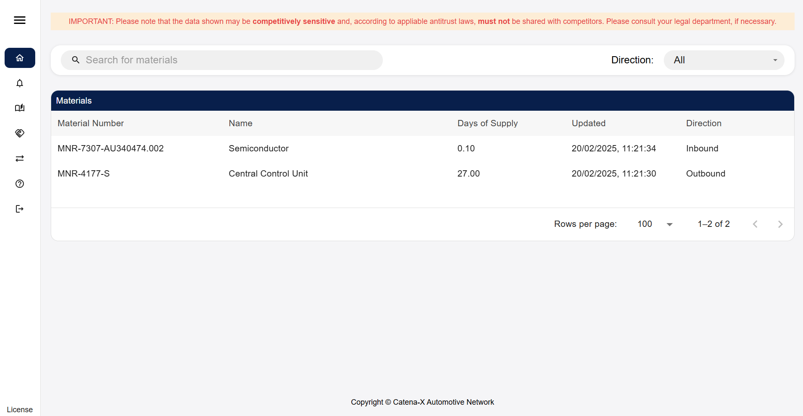
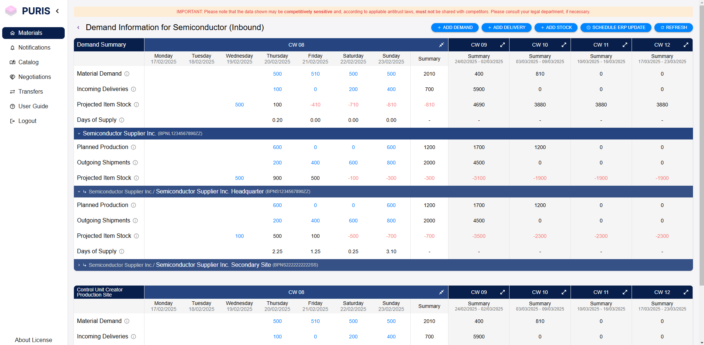
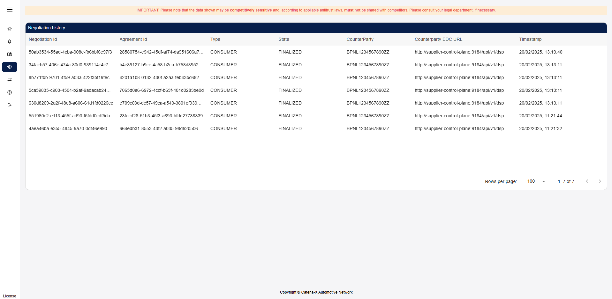

# User Guide

This guide explains the overall masks that may be used by different roles.

- A `PURIS_USER` may see and use the material list view, material details view, view this user guide, view the license information and log out.
- A `PURIS_ADMIN` may _additionally_ use the views "Notifications", "Catalog", "Negotiations" and "Transfers".

In the following the views are explained.

## Material List View

The Material List View allows users to quickly search and filter through materials.
It includes the following:

1. A search bar
2. A dropdown menu to select either incoming, outgoing, or any direction of the materials
3. A sortable list of all materials

### Searching materials

The user can find a specific material by using the search bar. The user can search through the materials using the material name or number. By default, it will be searching in any (incoming and outgoing) material direction. The user can choose a specific direction with the “Direction” dropdown.
By using the “Direction” dropdown menu the user can chose to narrow their search to view incoming materials, outgoing materials or both. The “Direction” dropdown can also be used to list all incoming or outgoing materials by leaving the search bar empty.

The user can further sort the materials by model number, material name, days of supply, direction and when they were last updated by clicking on the appropriate headers of the table.
The user can select a material by clicking on it. This will open the Materials Detail View.

## Materials detail view

The Material Detail View allows users to see a detailed view of the selected material. When selecting outgoing materials, the user is viewing their own production and their suppliers' demands. When selecting incoming materials, the user is viewing their own demand and partners' production.

It includes several expandable nested tables presented in the following order, based on the direction of the material:

- Outgoing materials
  1. Production summary for the material
  2. Production summary at a specific location
- Incoming materials
  1. Demand summary for the material
  2. Demand summary at a specific location

### Summary tables

Each overall or location specific summary table is separated into the following sections depending on the direction:

- Outgoing materials
  1. A production summary for the material
  2. A collapsible demand summary per customer
  3. A collapsible demand summary per specific location of a customer
- Incoming materials
  1. A demand summary for the material
  2. A collapsible production summary per supplier
  3. A collapsible production summary per specific location of a supplier

### Data overview

All the data is available for a 4 calendar-week period displaying the following data for supplier/customer respectively:

- Supplier
  1. Planned production
  2. Outgoing shipments
  3. Projected item stock
  4. Days of Supply
- Customer
  1. Short term material demand
  2. Incoming deliveries
  3. Projected item stock
  4. Days of Supply

Each calendar week is summarised in its own collapsable column. By clicking on the header, the column can be expanded to reveal detailed day to day information.
The user can view the data for an individula cell by clicking on the number.

Negative projected stock values inidicate a problem in the supply and will be marked in red

#### Updating partner data

The displayed data is mostly reported data from the partner. Therefore, it can become outdated.

In order to request an update of the data, the user can click the "Refresh" button at the top right of the section. This will start a request for updated data in the background.

After a short period of time, the user can refresh the page to be presented with the updated data.

_**Note:** The update process can take up to a minute._

#### Scheduling an ERP data update

The data may be updated manually or be updated periodically by the system. Whenever a partner asked for a specific
information OR the user triggered "SCHEDULE ERP UPDATE", then a periodic update is scheduled. It is automatically
cancelled after the update has not been triggered for a configured number of days.

This update is always:

- per partner
- per material
- per information (currently only stock is supported)
- per direction (e.g. stock is differentiated into stock as a customer or supplier)

In case of further information (e.g., update intervals), please contact your administrator or consult the Admin Guide.

### Adding data

In addition to viewing the user's own data, the user can also add new data for the selected material. The buttons for adding new data are located to the top right of the data view.

The user can add demand for the customer role as well as production output for the supplier. Deliveries and stock can be added for either role.

#### Adding demand

Upon clicking the "add demand" button, a popup will prompt the user to enter the details for the new demand. The material number will be pre-filled for the user.

To add a new demand the user:

1. Selects the appropriate demand location
2. Enters the estimated time of completion
3. Selects the demand category
4. Enters the quantity and the unit of measurement required
5. Selects the partner
6. (optional) Selects the expected supplier site
7. Clicks the "save" button

A notification in the top right of the user's screen will inform them, if saving was successful. Afterwards the user will see the newly added demand reflected in detailed material overview.

#### Adding production

Upon clicking the "add production" button, a popup will prompt the user to enter the details for the new production output. The material number will be pre-filled for the user based on the selected material.

To add a new production output, the user:

1. Selects the production site
2. Selects the partner to allocate the production to
3. Enters the estimated time of completion
4. Enters the quantity produced and the unit of measurement
5. (Optional) Fills the customer order number, customer position number and supplier order number
6. Clicks the "save" button

A notification in the top right of the user's screen will inform them, if saving was successful. Afterwards the user will see the newly added production output reflected in their detailed material overview.

#### Adding deliveries

Unlike demand and production output, deliveries can be added regardless of the user's role. Upon clicking "add delivery" the user will be presented with a popup for adding a new delivery. The material number will be pre-filled based on the user's selected material.

To add a new delivery the user:

1. Selects the partner for the delivery
2. Selects the incoterms for the delivery
3. Selects the quantity and unit of measurement
4. Enters the tracking number
5. Chooses the origin and destination site
6. Selects the departure type
7. Selects the date of departure
8. Selects the arrival type
9. Selects the date of arrival
10. (Optional) Fills the customer order number, customer position number and supplier order number
11. Clicks the "save" button

A notification in the top right of the user's screen will inform them, if saving was successful. Afterwards the user will see the newly added delivery reflected in their detailed material overview.

_**Note:** When entering a new delivery the user should make sure that:_

- _a date can only be of type actual if it is in the past_
- _arrival can only be of type actual if departure is as well_
- _departure must be before arrival_

#### Adding stock

Upon clicking the "Add stock" button, a popup will prompt the user to enter the details for the stock. The material number will be pre-filled for the user based on the selected material.

To add a new item, the user:

1. Selects the partner
2. Selects the quantity and unit of measurement
3. Selects the stock location BPNS
4. Selects the stock location BPNA
5. (Optional) Fills the customer order number, customer position number and supplier order number
6. (Optional) Checks the ‘is Blocked’ checkbox
7. Clicks the "save" button

A notification in the top right of the user's screen will inform them, if saving was successful. Afterwards the user will see the newly added stock reflected in their detailed material overview.

## Demand and Capacity Notifications

_DISCLAIMER: This feature has not yet been finished. Currently, users neither can't react to notifications nor can close notifications._

A user may use the page to send notifications to partners or read received notifications. One may choose the direction:

- `OUTGOING` for messages sent to a partner
- `INCOMING` for messages received from a partner

One may get further information by clicking on a notification in the list.

When triggering the button "SEND NOTIFICATION", a modal dialog is opened allowing a user to compose the demand and capacity notification.

After filling the mandatory data (see `*`), the user can send the notification:

- Partner (supplier or customer relationship)
- Leading Root Cause (one as defined by CX-0146 for demand and capacity notification)
- Status (either `Open` or `Closed`, use close to close disruptions)
- Effect (either `Increase` or `Decrease` of `Production` or `Demand`)
- Start Date of Effect
- End Date of Effect
- Affected Sites Senders
- Affected Material Numbers (only those applicable to the partner)
- Affected Sites Recipient
- Text

## Catalog

An admin may use the page to query offers available at a partner to check if the partner set up the information exchange
for this partner.

After choosing a partner from the dropdown and triggering the "Get Catalog" button, the admin
may see a list of available assets.

Per Catalog Item the following information is listed:

- Asset ID
- Asset Prop Type defining the asset type (close to CX Taxonomy)
- Asset actions
- Asset conditions
- Prohibitions (Contracts)
- Obligations (Contracts)

Note: Only catalog items / offers that can be accessed by the user are listed.

## Negotiations

An admin may use the page to see all recent negotiations and their state.

If no negotiation has been performed in the EDC yet, a message will be displayed informing the user of this fact.

Per Negotiation the following information is listed:

- Negotiation ID
- Type (is the user Data `PROVIDER` or Data `CONSUMER`)
- State of the negotiation
- Partner BPNL who either
  - initiated the negotiation (Type = `PROVIDER`) or
  - who the user asked to negotiate with (Type = `CONSUMER`)
- Partner's EDC DSP endpoint
- TimeStamp when the state of the negotiation has been set

_**Note**: Per data request per partner, the application looks up the data of interest in the Digital Twin Registry of a partner and then pulls the data._

## Transfers

An admin may use the page to see all recent transfers and their state.

If no transfer has been performed in the EDC yet, a message will be displayed informing the user of this fact.

Per Transfer the following information is listed:

- Transfer ID
- Correlation ID indicating the `Transfer ID` on partner site
- State of the negotiation
- TimeStamp when the state of the negotiation has been set
- Type (is the user Data `PROVIDER` or Data `CONSUMER`?)
- Asset ID that has been contracted
- Contract ID that has been the basis of the Transfer
- Partner BPNL who either
  - initiated the negotiation (Type = `PROVIDER`) or
  - who the user asked to negotiate with (Type = `CONSUMER`)

_**Note**: Per data request per partner, there are two Transfers as one contracts the partner's request asset and the
partner contracts the user's response asset._

---

## NOTICE

This work is licensed under the [Apache-2.0](https://www.apache.org/licenses/LICENSE-2.0).

- SPDX-License-Identifier: Apache-2.0
- SPDX-FileCopyrightText: 2024 Contributors to the Eclipse Foundation
- Source URL: [https://github.com/eclipse-tractusx/puris/blob/main/docs/user/User_Guide.md](https://github.com/eclipse-tractusx/puris/blob/main/docs/user/User_Guide.md)
