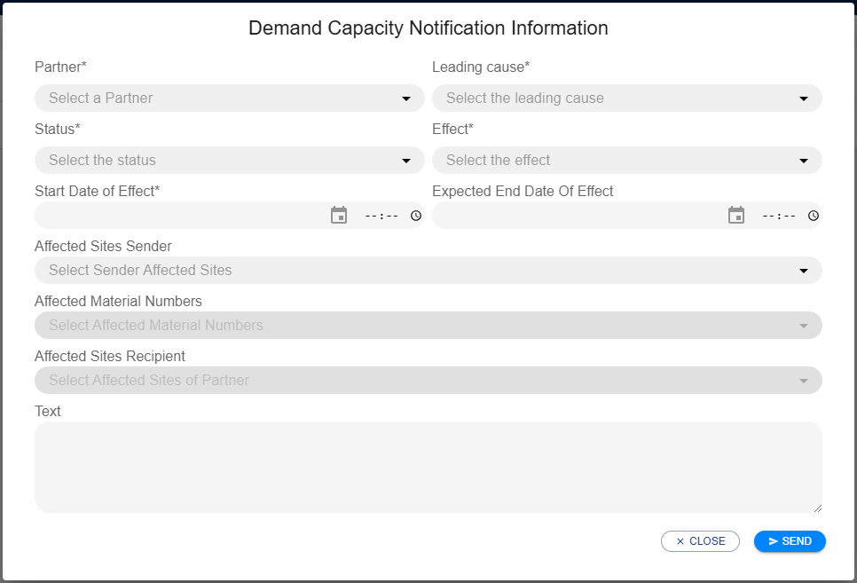
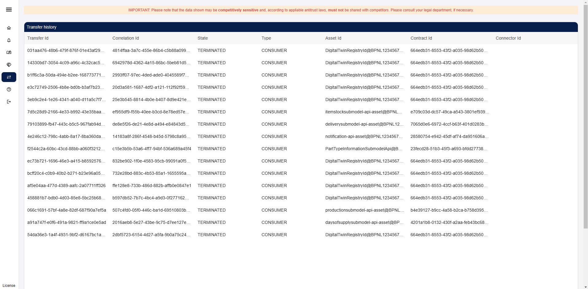

# User Guide

This guide explains the overall masks that may be used by different roles.

- A `PURIS_USER` may see use the views "Dashboard" and "Stocks".
- A `PURIS_ADMIN` may _additionally_ use the views "Catalog", "Negotiations" and "Transfers".

In the following the views are explained.

_**Note:** A user may additionally log out or see license information of the application._

## Dashboard

The Dashboard gives an overview over the user's own production output and demands and the corresponding information from the user's partners as well as incoming and outgoing deliveries.

It is visually divided in 4 horizontal parts:

1. Tabs for selecting the assumed role (customer or supplier)
2. Filters for selecting material, site and partner sites
3. Production/Demand information for selected site
4. Corresponding data for selected partner sites

### Selecting the user's role

Using the tabs the user can choose the role they want to assume. This choice determines what information is shown to them.

As a customer, the user will be shown the user's own site's demand and incoming deliveries as well as the user's customers' production output and outgoing shipments.

As a supplier, the user will be shown the user's own site's production output and outgoing shipments as well as the user's customers' demands and incoming deliveries.

In either case the user will always see the current and projected item stocks of both the user's own and the user's partners' sites.

### Using the filters

To show information in the dashboard the user have to first pick the material number the user are interested in followed by the user's own site. This will immediately display the available information for that material and site. the user can further select one or more partner sites to display the corresponding data.

_**Note:** Each filter requires the previous ones. The user can not filter by material number and partner sites alone._

### Own site data

Once the user has selected a material number and site they are presented with an overview of the site's data. Depending on the user's role they will see the demand and incoming deliveries or production output and outgoing shipments for customer and supplier respectively. In addition the user will see the current and projected item stock.

The data is displayed for up to the next 4 weeks depending on available data.

By clicking on an individual demand, production or delivery data cell the user can display detailed information for the given day.

### Adding data

In addition to viewing the user's own data, the user can also add new data for the selected material and site. The buttons for adding new data are located to the top right of the data view.

The user can add demands for the customer role as well as production output for the supplier. Deliveries can be added for either role, but they are always from the supplier to the customer.

#### Adding demand

Upon clicking the "create demand" button, a popup will prompt the user to enter the details for the new demand. The material number and site for the demand will be pre-filled for the user based on the filters the user have currently selected.

To add a new demand the user:

1. Enters the day of the demand
2. Selects the demand category
3. Enters the quantity required
4. Selects the unit of measurement
5. Selects the supplying partner
6. (Optional) Selects the expected supplier site
7. Clicks the "save" button

A notification in the top right of the user's screen will inform them, if saving was successful. Afterwards the user will see the newly added demand reflected in the their site data overview.

#### Adding production

Upon clicking the "create production" button, a popup will prompt the user to enter the details for the new production output. The material number and site for the production output will be pre-filled for the user based on the filters they have currently selected.

To add a new production output, the user:

1. Enters the estimated time of completion
2. Selects the customer to allocate the production to
3. Enters the quantity produced
4. Selects the unit of measurement
5. (Optional) Fills the order position reference
6. Clicks the "save" button

A notification in the top right of the user's screen will inform them, if saving was successful. Afterwards the user will see the newly added production output reflected in their site data overview.

#### Adding deliveries

Unlike demand and production output, deliveries can be added regardless of the user's role. Upon clicking "add delivery" the user will be presented with a popup for adding a new delivery. The material number will be pre-filled based on the user's selected material. Furthermore the origin or destination site will be filled for the supplier and customer roles respectively.

To add a new delivery the user:

1. Selects the departure type
2. Selects the date of departure
3. Selects the arrival type
4. Selects the date of arrival
5. Selects the partner for the delivery
6. Chooses the origin or destination site (depending on the user's role)
7. Enters the quantity
8. Selects the unit of measurement
9. (Optional) Enters the tracking number
10. Selects the incoterms for the delivery
11. (Optional) Fills the order position reference
12. Clicks the "save" button

A notification in the top right of the user's screen will inform them, if saving was successful. Afterwards the user will see the newly added delivery reflected in their site data overview.

_**Note:** When entering a new delivery the user should make sure that:_

- _a date can only be of type actual if it is in the past_
- _arrival can only be of type actual if departure is as well_
- _departure must be before arrival_

### Partner site data

By selecting one or more partner sites from the filters the user is presented with their data. Depending on the user's chosen role these tables will show the demand and incoming shipments or planned production output and outgoing shipments respectively. In both cases they will also show the current and projected item stock at each partner site.

The data is displayed for up to the next 4 weeks depending on available data.

The user can click individual production output, demand or delivery data cells to display detailed information.

#### Updating partner data

The displayed data in this section is mostly reported data from the partner. Therefore it can become outdated.

In order to request an update of the data, the user can click the "Refresh" button at the top right of the section. This will start a request for updated data in the background.

Afterwards, when the user refreshes the page, they will be presented with the updated data.

_**Note:** The update process can take a few seconds._

#### Scheduling an ERP data update

The data may be updated manually or be updated periodically by the system. Whenever a partner asked for a specific 
information OR the user triggered "SCHEDULE ERP UPDATE", then a periodic update is scheduled. It is automatically 
cancelled after the update has not been triggered for a configured number of days.

This update is always:

- per partner
- per material
- per information (currently only stock is supported)
- per direction (e.g. stock is differentiated into stock as a customer or supplier)

In case of further information (e.g., update intervals), please contact your administrator or consult the Admin Guide.

## View and Manage Stocks

This view allows a user to either create material or product stocks and allocate them to a partner. Stocks always need
to be allocated to a partner due to potential multi-sourcing scenarios.

The view is divided horizontally into three parts:

1. Create or Update Material / Product Stocks
2. Own Stocks
3. Reported Stocks from partners

### Create or update Material / Product Stocks

This view allows the user to add a material or product by choosing the corresponding tab.

To add a new item, the user:

1. Selects the Material/Product from the dropdown
2. Sets the partner who will receive (Product) or from whom one received (Material) the stock.
3. Sets a quantity that is on stock with a selected unit of measurement (UOM).
4. Whether the stock is blocked or not (e.g. quality assurance ongoing).
5. The stocks location based on a Site (BPNS) and a corresponding Address (BPNA).
6. Optionally adds a reference to order positions.
7. Clicks the "Add or Update" Button

Upon successful creation a toast notification is displayed and the new stock is added to the "Your Stock" table.

### The User's Stocks

The table shows the relevant information regarding all material / product stocks that are at the user's sites. The user may select one
stock to see the corresponding stock at the partner's site.

### The User's Customers' / Suppliers' Stocks

Upon selecting a material / product this table shows detailed information about the corresponding stocks at this partner's site. Using the button
"Refresh Stocks", the user may request an update of this data for all partners who supply the
material / product.

_**Note:** Stock information is updated asynchronously. The user may reload the page later to see the updated data._

## Demand and Capacity Notifications

_DISCLAIMER: This feature has not yet been finished. Currently, users neither can't react to notifications nor can close
notifications._

An user may use the page to send notifications to partners or read received notifications. One may chose the direction:

- `OUTGOING` for messages sent to a partner
- `INCOMING` for messages received from a partner

One may get further information by double clicking on a notification in the list.

When triggering the button "SEND NOTIFICATION", a modal dialog is opened allowing a user to compose the demand and 
capacity notification.

After filling the mandatory data (see `*`), the user can send the notification:

- Text
- Partner (supplier or customer relationship)
- Leading Root Cause (one as defined by CX-0146 for demand and capacity notification)
- Status (either `Open` or `Closed`, use close to close disruptions)
- Effect (either `Increase` or `Decrease` of `Production` or `Demand`)
- Start Date of Effect
- End Date of Effect
- Affected Sites Senders
- Affected Sites Recipient
- Affected Material Numbers (only those applicable to the partner)

## Catalog

An admin may use the page to query offers available at a partner to check if the partner set up the information exchange
for this partner.

After choosing a partner from the dropdown and triggering the "Get Catalog" button, the admin
may see a list of available assets.

Per Catalog Item the following information is listed:

- Asset ID
- Asset Prop Type defining the asset type (close to CX Taxonomy)
- Asset actions
- Asset conditions
- Prohibitions (Contracts)
- Obligations (Contracts)

Note: Only catalog items / offers that can be accessed by the user are listed.

## Negotiations

An admin may use the page to see all recent negotiations and their state.

If no negotiation has been performed in the EDC yet, a message will be displayed informing the user of this fact.

Per Negotiation the following information is listed:

- Negotiation ID
- Type (is the user Data `PROVIDER` or Data `CONSUMER`)
- State of the negotiation
- Partner BPNL who either
  - initiated the negotiation (Type = `PROVIDER`) or
  - who the user asked to negotiate with (Type = `CONSUMER`)
- Partner's EDC DSP endpoint
- TimeStamp when the state of the negotiation has been set

_**Note**: Per data request per partner, the application looks up the data of interest in the Digital Twin Registry of a partner and then pulls the data._

## Transfers

An admin may use the page to see all recent transfers and their state.

If no transfer has been performed in the EDC yet, a message will be displayed informing the user of this fact.

Per Transfer the following information is listed:

- Transfer ID
- Correlation ID indicating the `Transfer ID` on partner site
- State of the negotiation
- TimeStamp when the state of the negotiation has been set
- Type (is the user Data `PROVIDER` or Data `CONSUMER`?)
- Asset ID that has been contracted
- Contract ID that has been the basis of the Transfer
- Partner BPNL who either
  - initiated the negotiation (Type = `PROVIDER`) or
  - who the user asked to negotiate with (Type = `CONSUMER`)

_**Note**: Per data request per partner, there are two Transfers as one contracts the partner's request asset and the
partner contracts the user's response asset._
