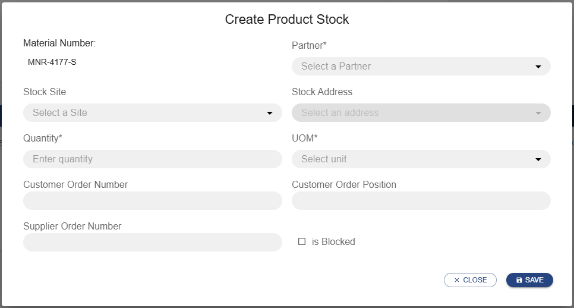

# User Guide

This guide explains the overall masks that may be used by different roles.

- A `PURIS_USER` may see and use the material list view, material details view, view this user guide, view the license information and log out.
- A `PURIS_ADMIN` may _additionally_ use the views "Notifications", "Catalog", "Negotiations" and "Transfers".

In the following the views are explained.

## Material list view

The Material List View allows users to quickly search and filter through materials.
It includes the following:

1. A search bar
2. A dropdown menu to select either incoming, outgoing, or any direction of the materials
3. A sortable list of all materials

### Searching materials

The user can find a specific material by using the search bar. The user can search through the materials using the material name or number. By default, it will be searching in any (incoming and outgoing) material direction. The user can choose a specific direction with the “Direction” dropdown.
By using the “Direction” dropdown menu the user can chose to narrow their search to view incoming materials, outgoing materials or both. The “Direction” dropdown can also be used to list all incoming or outgoing materials by leaving the search bar empty.

The user can further sort the materials by material number, material name, days of supply, direction and when they were last updated by clicking on the appropriate headers of the table.
The user can select a material by clicking on it. This will open the Materials Detail View.

## Materials detail view

The Material Detail View allows users to see a detailed view of the selected material. When selecting outgoing materials, the user is viewing their own production and their suppliers' demands. When selecting incoming materials, the user is viewing their own demand and partners' production.

It includes several expandable nested tables presented in the following order, based on the direction of the material:

- When seeing material details for outgoing materials, the following summaries are shown:
  1. Production summary for the material
  2. Production summary at a specific location
- When seeing materials for the incoming direction, the following summaries are shown:
  1. Demand summary for the material
  2. Demand summary at a specific location

### Summary tables

Each overall or location specific summary table is separated into the following sections depending on the direction:

- When seeing materials for the outgoing direction, the following summaries are shown:
  1. A production summary for the material
  2. A collapsible demand summary per customer
  3. A collapsible demand summary per specific location of a customer
- When seeing materials for the incoming direction, the following summaries are shown:
  1. A demand summary for the material
  2. A collapsible production summary per supplier
  3. A collapsible production summary per specific location of a supplier

### Data overview

All the data is available for a 4 calendar-week period displaying the following data for supplier/customer respectively:

- Supplier
  1. Planned production
  2. Outgoing shipments
  3. Projected item stock
  4. Days of Supply
- Customer
  1. Short term material demand
  2. Incoming deliveries
  3. Projected item stock
  4. Days of Supply

Each calendar week is summarised in its own collapsable column. By clicking on the header, the column can be expanded to reveal detailed day to day information.
The user can view the data for an individula cell by clicking on the number.

Negative projected stock values inidicate a problem in the supply and will be marked in red

#### Updating partner data

The displayed data is mostly reported data from the partner. Therefore, it can become outdated.

In order to request an update of the data, the user can click the "Refresh" button at the top right of the section. This will start a request for updated data in the background indicated by a loading spinner in the "Refresh" button.

After a short period of time the partner data will automatically be updated with the new values. This is indicated by a toast notification in the top right corner of the screen.

_**Note:** The update process can take up to a minute._

#### Scheduling an ERP data update

The data may be updated manually or be updated periodically by the system. Whenever a partner asked for a specific
information OR the user triggered "SCHEDULE ERP UPDATE", then a periodic update is scheduled. It is automatically
cancelled after the update has not been triggered for a configured number of days.

This update is always:

- per partner
- per material
- per information (currently only stock is supported)
- per direction (e.g. stock is differentiated into stock as a customer or supplier)

In case of further information (e.g., update intervals), please contact your administrator or consult the Admin Guide.

### Adding data

In addition to viewing the user's own data, the user can also add new data for the selected material. The buttons for adding new data are located to the top right of the data view.

The user can add demand for the customer role as well as production output for the supplier. Deliveries and stock can be added for either role.

#### Adding demand

Upon clicking the "add demand" button, a popup will prompt the user to enter the details for the new demand. The material number will be pre-filled for the user.

To add a new demand the user:

1. Selects the appropriate demand location
2. Enters the estimated time of completion
3. Selects the demand category
4. Enters the quantity and the unit of measurement required
5. Selects the partner
6. (optional) Selects the expected supplier site
7. Clicks the "save" button

A notification in the top right of the user's screen will inform them, if saving was successful. Afterwards the user will see the newly added demand reflected in detailed material overview.

#### Adding production

Upon clicking the "add production" button, a popup will prompt the user to enter the details for the new production output. The material number will be pre-filled for the user based on the selected material.

To add a new production output, the user:

1. Selects the production site
2. Selects the partner to allocate the production to
3. Enters the estimated time of completion
4. Enters the quantity produced and the unit of measurement
5. (optional) Fills the customer order number, customer position number and supplier order number
6. Clicks the "save" button

A notification in the top right of the user's screen will inform them, if saving was successful. Afterwards the user will see the newly added production output reflected in their detailed material overview.

#### Adding deliveries

Unlike demand and production output, deliveries can be added regardless of the user's role. Upon clicking "add delivery" the user will be presented with a popup for adding a new delivery. The material number will be pre-filled based on the user's selected material.

To add a new delivery the user:

1. Selects the partner for the delivery
2. Selects the incoterms for the delivery
3. Selects the quantity and unit of measurement
4. (optional) Enters the tracking number
5. Chooses the origin and destination site
6. Selects the departure type
7. Selects the date of departure
8. Selects the arrival type
9. Selects the date of arrival
10. (optional) Fills the customer order number, customer position number and supplier order number
11. Clicks the "save" button

A notification in the top right of the user's screen will inform them, if saving was successful. Afterwards the user will see the newly added delivery reflected in their detailed material overview.

_**Note:** When entering a new delivery the user should make sure that:_

- _a date can only be of type actual if it is in the past_
- _arrival can only be of type actual if departure is as well_
- _departure must be before arrival_

#### Adding stock

Upon clicking the "Add stock" button, a popup will prompt the user to enter the details for the stock. The material number will be pre-filled for the user based on the selected material.

To add a new item, the user:

1. Selects the partner
2. Selects the quantity and unit of measurement
3. Selects the site of the stock location (BPNS)
4. (optional) Selects the address of the stock location (BPNA)
5. (optional) Fills the customer order number, customer position number and supplier order number
6. (optional) Checks the ‘is Blocked’ checkbox
7. Clicks the "save" button

A notification in the top right of the user's screen will inform them, if saving was successful. Afterwards the user will see the newly added stock reflected in their detailed material overview.

### Updating or deleting data

In addition to adding and viewing the user's own data, the user can also update and delete his data for the selected material. These actions are available for own data (not partner data received via the [refresh functionality](#updating-partner-data)).

To update information,

1. Follow the blue link reflecting your own summarized information (1 in image below).
2. In the modal dialog, per row, the options to edit (pencil icon) and remove (trash bin icon) are offered (2 in image below).
3. Triggering the edit functionality will open another information-specific modal dialog on top. These modal dialogs are explained information-wise in the sections below. After saving this dialog or directly after triggering the trash bin, the changes will be reflected in the tables and a notification will be shown in the upper right corner informing the user about success or failure of the operation (3 in image below).

The user can update or edit demand for the customer role as well as production output for the supplier. Deliveries and stock can be updated or deleted for either role.

> _**NOTE**: Updates are not allowed for all fields. If a user needs to change a field that may not be updated, then the user needs to delete the exisitng information and create it newly. Further updates of the allocated partner or sites are not allowed for all modal dialogs. Please find more information in the secions below._
>

#### Updating demand

Upon clicking the "edit" pencil button, a popup will demand the user to update the details for the demand. The dialog will be pre-filled for the user based on the selected demand.

The following fields may be updated for a demand:

1. Quanitity demanded
2. Day of the demand
3. Cateogy of the demand

The user may confirm the changes using the "save" button or abort using the "close" button respectively "escape".

A notification in the top right of the user's screen will inform them, if saving was successful. Afterwards the user will see the updated demand reflected in detailed material overview.

#### Updating production

Upon clicking the "edit" pencil button, a popup will prompt the user to update the details for the production output. The dialog will be pre-filled for the user based on the selected production.

The following fields may be updated for a production output:

1. Estimated time of completion
2. Quantity planned for production
3. (optional) customer order number, customer position number and supplier order number

The user may confirm the changes using the "save" button or abort using the "close" button respectively "escape".

A notification in the top right of the user's screen will inform them, if saving was successful. Afterwards the user will see the updated production output reflected in their detailed material overview.

#### Updating deliveries

Unlike demand and production output, own deliveries can be updated regardless of the user's role. Upon clicking the "edit" pencil button, a popup will prompt the user to update the details for the selected delivery. The dialog will be pre-filled for the user based on the selected delivery.

The following fields may be updated for a delivery:

1. Departure and arrival type (if it has not been changed to type actual)
2. Departure and arrival date and time (if the corresponding type has not been changed to actual)
3. Quantity considered for delivery
4. (optional) Tracking number
5. (optional) customer order number, customer position number and supplier order number

The user may confirm the changes using the "save" button or abort using the "close" button respectively "escape".

A notification in the top right of the user's screen will inform them, if saving was successful. Afterwards the user will see the updated delivery reflected in their detailed material overview.

_**Note:** When entering updating a delivery the user should make sure that:_

- _a date can only be of type actual if it is in the past_
- _arrival can only be of type actual if departure is as well_
- _departure must be before arrival_

#### Updating stock

Upon clicking the "edit" pencil button, a popup will prompt the user to update the details for the selected stock. The dialog will be pre-filled for the user based on the selected delivery.

The following fields may be updated for a stock:

1. Quantity considered for delivery
2. (optional) Tracking number
3. Is Blocked

The user may confirm the changes using the "save" button or abort using the "close" button respectively "escape".

A notification in the top right of the user's screen will inform them, if saving was successful. Afterwards the user will see the newly added stock reflected in their detailed material overview.

## Demand and Capacity Notifications

A user may use the page to send notifications to partners or read received notifications.

- `OPEN` for grouped messages that have at least one message open
- `RESOLVED` for grouped messages that have all been resolved

The notifications are grouped into collapsible sections based on their source disruption. Each collapsible displays the cause as well as effect of the disruption and can be expanded to display the list of notifications in table form.
The table displays `Outgoing` if the message was sent to a partner and `Incoming` if it was received from a partner.
If the notification has been resolved, the row will be grayed out and the text column will additionally display the Resolution Message.

### Notification View

One may get further information by clicking on a notification in the list.

### Notification Detail Modal

When triggering the button "NEW NOTIFICATION", a modal dialog is opened allowing a user to compose the demand and capacity notification. This creates a grouped section with the notification visible in the table.

### Send Notification Modal

After filling the mandatory data (see `*`), the user can send the notification:

- Partner (supplier or customer relationship)
- Leading Cause (one as defined by CX-0146 for demand and capacity notification)
- Status (this field is automatically pre-selected with the `Open` option)
- Effect (either `Increase` or `Decrease` of `Production` or `Demand`)
- Start Date of Effect
- (optional) End Date of Effect
- (optional) Affected Sites Senders
- (optional) Affected Material Numbers (only those applicable to the partner)
- (optional) Affected Sites Recipient
- Text

If an outgoing notification has the status `Open` the user can interact with it by either editing it or resolving it.
When triggering the edit button the same modal is opened as for the new notification, the fields pre-populated with existing data.

### Edit Notification Modal

When the resolve button is triggered a modal dialog is opened allowing a user to write a resolution message and when saving will automatically change the status of the notification to `Resolved`.

### Resolve Notification Modal

If there is an outgoing open notification a user can resolve it by triggering the "Resolve" inline button (checkmark icon). This opens the resolution modal with a mandatory resolution message. Once submitted the status of the ticket is changed to resolved and cannot be edited. The text column is updated to contain the resolution message as well.

### Forward Notification Modal

A user can also create a notification related to one of the existing open groups by triggering the "FORWARD" button. This opens the creation modal.
The following fields are pre-selected and read only:

- Leading cause (same as the related notifications)
- Effect (same as the related notifications)
- Status (this field is automatically pre-selected with the `Open` option)

The Partner field only provides options for partners that aren't linked to any of the related or any of the existing outgoing notifications. This creates another entry in the existing table.

## Master Data Maintenance

> [!info]
>
> Master Data can only be added by users with the role `PURIS_ADMIN`.
>

To setup PURIS, you need to provide master data to the system. Right now you can only create master data and there is no integration with business partner data mangement. Thus, you need to create the following data:

- Material Data: Material (Inbound Material), Products (Outbound Material) and Trading Goods (Bidirectional Material)
- Partner Data: Parnters with their sites and address including their connector address.
- Material Partner Relationships: The linkage whether you buy a material from or sell a product to a partner.

> [!info]
>
> When creating the Material Partner Relationship, PURIS FOSS will do the following:
>
> - for inbound material: lookup the product twin (part type) at the partner and take over the global asset id to create your local copy. The product twin will be registered with the material numbers of your and your partner within our Digital Twin Registry.
> - for outbound material: create the product twin (part type). The product twin will be registered with the material numbers of your and your partner within our Digital Twin Registry.
>

This master data maintenance can either be done via the backend interfaces ([Admin Guide, chapter Onboarding your Data](../admin/Admin_Guide.md#onboarding-your-data); [Interface Dcocmentation and swagger-ui](../api/Interface_Doc.md)). The following part will only focus on the user interface!

This can be found in the navigation bar under the item "Master Data".

Please always follow these three steps:

1. Create Partner. Pay attention to Business Partner Numbers (BPN) for Legal Entities (BPNL), Sites (BPNS) and Addresses (BPNA).
2. Create the Material / Product / Trading Good. Pay attention to direction (Inbound = something you buy, Outbound = something you sell, Bidirection = both).
3. Create the Material Partner Relationship. Pay attention whether your partner buys or sells the the good (direction).

### Create Partner

> [!note]
>
> Please keep in mind that right now partner information can't be changed.
>

In the Partners table you can see the onboarded partners. To create a partner you need to trigger the button "New Partner" in the upper right corner and fill out the mandatory information marked by an **asteric (*)**.

General Partner Information

- Partner Name: Legal name of your partner
- BPNL: Catena-X identifier for the legal entity (your business partner)
- EDC URL: URL of your partner's connector **including the DSP endpoint**

Addresses of the legal entity (commonly those that are no manufacturing sites but important for e.g. invoicing)

- BPNA: Catena-X identifier for the address
- Street
- Number
- Zip Code
- City
- Country: 2 Digit Iso Code

Sites of the legal entity (commonly where they manufacture)

- BPNS: Catena-X identifier for the site
- Site Name: Official name for reference
- one or more addresses

A notification will mention issues or success of the creation after triggering the "Save" button.

### Create Material

> [!note]
>
> Please keep in mind that right now material information can't be changed.
>

In the  Materials table you can see the onboarded materials. To create a material you need to trigger the button "New Material" in the upper right corner and fill out the mandatory information marked by an **asteric (*)**.

- Material Number: your internal material number
- Name: your official name for the material
- Global Asset Id: enter in case you want to have a catena-x global asset id
- Direction: define if it's an inbound material, an outbound product or a bidirectional good

A notification will mention issues or success of the creation after triggering the "Save" button.

### Create Material Partner Relatinship

> [!note]
>
> Please keep in mind that right now material information can't be changed.
>
> This step triggers communication with the partner in the network for inbound material AND creates the digital wins in all cases. In case the lookup does not succeed, the application retriggers the lookup for twin completion during when triggering the data exchange (see [Material Details View](#materials-detail-view)).
>

In the Material Partner Relationships table you can see the assigned relationships between partners and materials. To create the relationship you need to trigger the button "New Relation" in the upper right corner and fill out the mandatory information marked by an **asteric (*)**.

- Material
- Partner
- Patner Material Number: Customer part id for outbound product, manufacturer part id for inbound material
- Supplies material / buys material: defaulted based on diretion. Either a partner buys inbound material or supplies outbound products

A notification will mention issues or success of the creation after triggering the "Save" button.

## Import

An Admin can upload data in this page. Once the file is uploaded, all existing data for that type will be replaced by the newly uploaded data. This action only takes place if the file does NOT contain any invalid information. All infvalid rows are listed to the user with the respective validation error messages. Users can click and download one of pre-existing template files listed on the page:

- delivery-template.xlsx
- demand-template.xlsx
- production-template.xlsx
- stock-template.xlsx

Right now, only files of type xlsx are supported.

### Formula support

The import feature evaluates formulas to dynamically calculate values. Due to technical limitations of the underlying Java library Apache POI not all functions are supported. You can find a list of supported functions int the [Apache POI documentation](https://poi.apache.org/components/spreadsheet/eval-devguide.html#appendixA).

### Import view

After each file has been uploaded, the user is notified on whether the upload was successful and if not, what the potential issues could be.

## Catalog

An admin may use the page to query offers available at a partner to check if the partner set up the information exchange
for this partner.

After choosing a partner from the dropdown and triggering the "Get Catalog" button, the admin
may see a list of available assets.

Per Catalog Item the following information is listed:

- Asset ID
- Asset Prop Type defining the asset type (close to CX Taxonomy)
- Asset actions
- Asset conditions
- Prohibitions (Contracts)
- Obligations (Contracts)

Note: Only catalog items / offers that can be accessed by the user are listed.

## Negotiations

An admin may use the page to see all recent negotiations and their state.

If no negotiation has been performed in the EDC yet, a message will be displayed informing the user of this fact.

Per Negotiation the following information is listed:

- Negotiation ID
- Type (is the user Data `PROVIDER` or Data `CONSUMER`)
- State of the negotiation
- Partner BPNL who either
  - initiated the negotiation (Type = `PROVIDER`) or
  - who the user asked to negotiate with (Type = `CONSUMER`)
- Partner's EDC DSP endpoint
- TimeStamp when the state of the negotiation has been set

_**Note**: Per data request per partner, the application looks up the data of interest in the Digital Twin Registry of a partner and then pulls the data._

## Transfers

An admin may use the page to see all recent transfers and their state.

If no transfer has been performed in the EDC yet, a message will be displayed informing the user of this fact.

Per Transfer the following information is listed:

- Transfer ID
- Correlation ID indicating the `Transfer ID` on partner site
- State of the negotiation
- TimeStamp when the state of the negotiation has been set
- Type (is the user Data `PROVIDER` or Data `CONSUMER`?)
- Asset ID that has been contracted
- Contract ID that has been the basis of the Transfer
- Partner BPNL who either
  - initiated the negotiation (Type = `PROVIDER`) or
  - who the user asked to negotiate with (Type = `CONSUMER`)

_**Note**: Per data request per partner, there are two Transfers as one contracts the partner's request asset and the
partner contracts the user's response asset._

---

## NOTICE

This work is licensed under the [Apache-2.0](https://www.apache.org/licenses/LICENSE-2.0).

- SPDX-License-Identifier: Apache-2.0
- SPDX-FileCopyrightText: 2024 Contributors to the Eclipse Foundation
- SPDX-FileCopyrightText: 2026 Fraunhofer-Gesellschaft zur Foerderung der angewandten Forschung e.V. (represented by Fraunhofer ISST)
- Source URL: [https://github.com/eclipse-tractusx/puris/blob/main/docs/user/User_Guide.md](https://github.com/eclipse-tractusx/puris/blob/main/docs/user/User_Guide.md)
