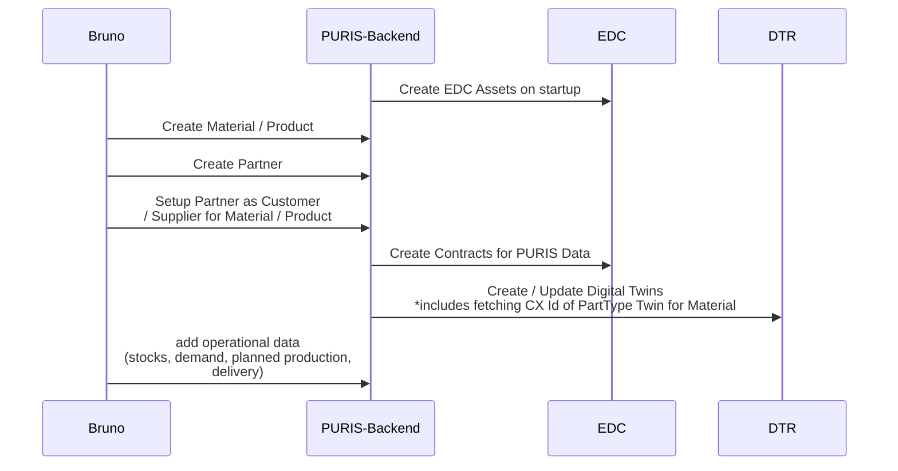

# Your task

You should provide the data to your partners always in the following order.

Please

1. Install [Bruno client](https://www.usebruno.com/downloads) (if not done)
2. Checkout the repository (github.com/eclipse-tractusx/puris)
3. Go to the directory `etx-community-days`
4. Open the Bruno Collection (`etx-community-days/community-days` > open)
5. In the [CASE_DATA.md](./CASE_DATA.md) go to your respective company
    1. Update your bruno environment based on the current seed (you need to update material & partner-wise)
    2. Seed data following the prioritization with bruno
6. Align with your partners on information exchange (are you setup?)

Participants based on their complexity (+ signs for indication) and relevance:

1. Tier A (+++)
2. Sub Tier A (++)
3. OEM-B (++)
4. N Tier (++)
5. Tier B (++)
6. Natural Rubber (+)
7. Tier C & (+)
8. Sub Tier B (+)

## NOTICE

This work is licensed under the [CC-BY-4.0](https://creativecommons.org/licenses/by/4.0/legalcode).

- SPDX-License-Identifier: CC-BY-4.0
- SPDX-FileCopyrightText: 2025 Fraunhofer-Gesellschaft zur Foerderung der angewandten Forschung e.V. (represented by Fraunhofer ISST)
- SPDX-FileCopyrightText: 2025 Contributors to the Eclipse Foundation
- Source URL: https://github.com/eclipse-tractusx/puris
